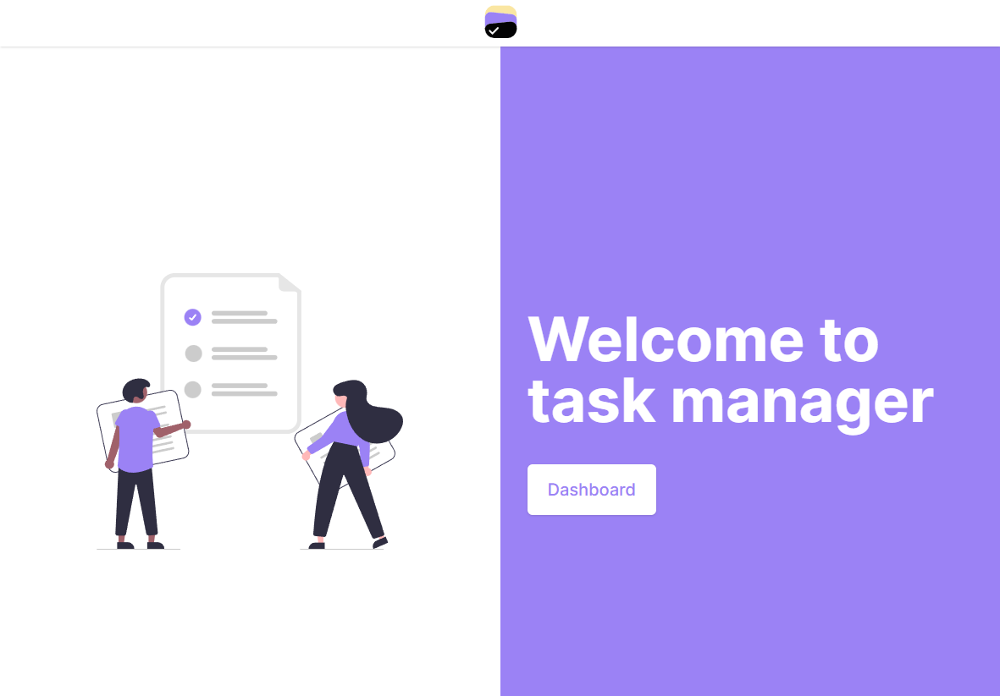

  <div align="center">
     
    <h1> 
      Task Maneger
    </h1>
  </div>
  

A responsive web application for task management, offering an intuitive dashboard with features for adding, editing and deleting tasks

<h1 align="center">
  
</h1>

## 🛠️ Technologies

- [Next.js](https://nextjs.org/) 
- [TypeScript](https://www.typescriptlang.org/) 
- [React](https://react.dev/) 
- [Jest](https://jestjs.io/pt-BR/) 
- [Tailwind CSS](https://tailwindcss.com/) 
- [Zustand](https://www.typescriptlang.org/) 
## 🎯 Objective

The objective of this project is developer a modern resposive web app for tasks management. With an user-friendly interaface, where the users would can to view, add, edit and delete task efienetly

## 🔨 Features
- [x] Add task
- [x] Edit task
- [x] Delete task
- [x] Choose user assignee

## 📁 Project Estructure

```
📁 public
│
└── 📁 images
│   
└── 📁 src
    │
    └── 📁 pages
    │
    └── 📁 components
    │
    └── 📁 hooks
    │
    └── 📁 models
    │
    └── 📁 utils
    │
    └── 📄 page.tsx
```

## 🚦 Getting Started

### Installing Dependencies

```bash
npm install
# or
yarn install
```

### Starting the Project

```bash
npm run dev
# or
yarn dev
```

### Testing the Project

```bash
npm run test
# or
yarn test
```

## 🙋 Author

Name: Danilo Oliveira Lima  
LinkedIn: [Danilo Lima](https://www.linkedin.com/in/danilo-lima-a62aa91a0/)  
Role: Desenvolvedor Web
